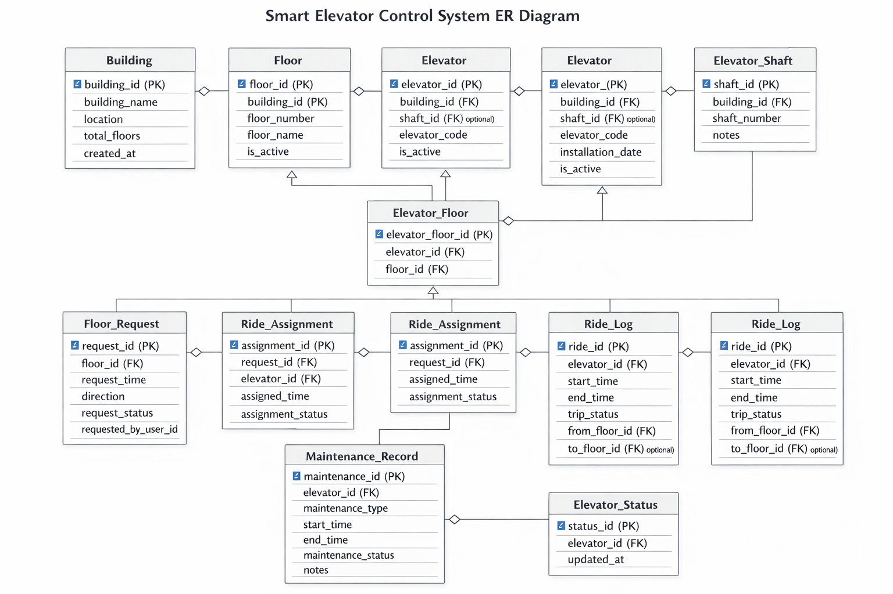

# Smart Elevator Control System – ER Diagram

This project contains an ER diagram for a Smart Elevator Control System used in large buildings.

---

## ER Diagram

---

## Overview

The system manages:

- Buildings and floors  
- Elevators and shafts  
- Floor requests and assignments  
- Ride logs  
- Maintenance records  
- Elevator status  

---

## Entities

- Building  
- Floor  
- Elevator  
- Elevator_Shaft  
- Elevator_Floor  
- Floor_Request  
- Ride_Assignment  
- Ride_Log  
- Maintenance_Record  
- Elevator_Status  

---

## Key Points

- Separate tables for static and dynamic data  
- Junction table for Elevator ↔ Floor  
- Tracks rides, maintenance, and status  
- Designed for scalability  

---

## Usage

Useful for:

- Database design  
- Projects and portfolios  
- Academic work  

---

## Author

Gaurav Kataria
